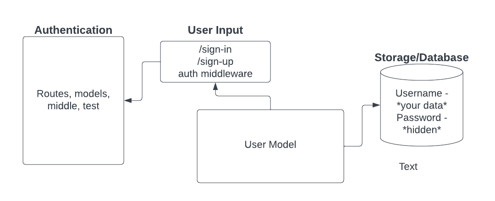

# LAB - 06

## Project: Basic-Authentication

### Author: Kao Saelor

### Problem Domain

Deploy an Express server that implements Basic Authentication, with signup and signin capabilities, using a Postgres database for storage.

### Links and Resources

- [GitHub Actions ci/cd](https://github.com/CodingKao/basic-auth/pulls)

- [back-end prod server url](https://basic-auth-wd0v.onrender.com/)

### Collaborators

- Use Ryan Gallaway, Code Fellow Instructor, stater code
- Kenya Womack
- Hayden Cooper
- Coriana Williams

### Setup

#### `.env` requirements (where applicable)

Using only PORT which can be found on `.env.sample`

#### How to initialize/run your application (where applicable)

Clone repo, `npm i`, then run `nodemon` in the terminal

#### Routes

- GET : `/` - specific route to hit

#### Tests

To run tests, after running `npm i`, run the command `npm test`

#### Lab 6 UML

